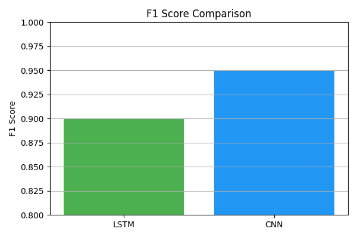

# 🇧🇷🇵🇹 Portuguese Variant Classification with LSTM & CNN

This project was developed as part of a Machine Learning course challenge and submitted to the Kaggle competition:

🔗 [Portuguese Variant Identification – Kaggle](https://www.kaggle.com/competitions/portuguese-variant-identification)

The goal was to **build a classifier that distinguishes between Brazilian Portuguese (pt-BR) and European Portuguese (pt-PT)** using natural language processing techniques. The best model achieved a **precision score of 0.93009**.

---

## 🎯 Objective

Train deep learning models to classify short text inputs as either pt-BR or pt-PT, using a combined dataset from Hugging Face and DSL-TL, and apply tuning strategies to improve classification performance in an unbalanced dataset.

---

## 🧪 Datasets

- **Hugging Face Dataset** (from the competition)
- **DSL-TL Dataset**: [GitHub](https://github.com/LanguageTechnologyLab/DSL-TL)

Both datasets were merged to increase the linguistic coverage and training corpus.

---

## 📚 Pipeline

### 1. Dataset Preparation
- Loaded datasets from Hugging Face and DSL-TL.
- Assigned class labels:
  - `0` → Portuguese (pt-PT)
  - `1` → Brazilian Portuguese (pt-BR)
- Cleaned and converted data to usable format.
- Merged the datasets into a single corpus.

### 2. Tokenization
- Applied tokenizer (BERT-based or custom, depending on cell).
- Resulted in ~110 tokens per input (avg).

### 3. Modeling Strategy

#### 🔹 LSTM Model
- Used for initial training and evaluation.
- Defined `F1-score` as main metric due to class imbalance.
- Applied hyperparameter tuning.
- Saved best model for prediction and comparison.

#### 🔹 CNN Model
- Trained a 1D CNN as an alternative approach.
- Tuned model and compared performance with LSTM.
- Final predictions made using best CNN model.

---

## 📊 Results

The project aimed to classify text between Brazilian Portuguese (pt-BR) and European Portuguese (pt-PT) using deep learning models. Two architectures were evaluated: **LSTM** and **CNN**.

- **Main evaluation metric:** F1 Score (due to class imbalance)
- **Best result:** CNN with **F1 Score = 0.95**
- **LSTM result:** F1 Score = 0.90

### 🔹 F1 Score Comparison




---

## 🔧 Technologies Used

- Python, Pandas, NumPy
- PyTorch / Keras
- Scikit-learn
- Hugging Face Transformers
- Matplotlib / Seaborn

---


---

## ▶️ How to Run

1. Clone the repository:
   ```bash
   git clone https://github.com/seuusuario/pt-variant-classification.git
   cd pt-variant-classification
   ```
2. Install dependencies:
  ```bash
  pip install -r requirements.txt
  ```

3. Open the notebook:
  ```bash
  notebooks/NLP.ipynb
  ```

